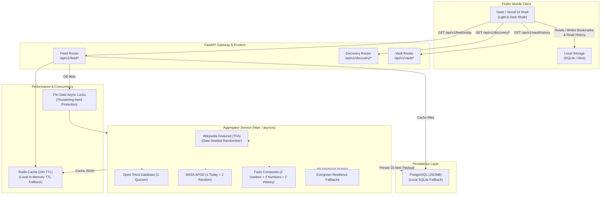

# Curiosity Microlearning Application - System Architecture

## 1. High-Level System Overview

The application is a daily microlearning and discovery mobile platform inspired by the classic Curiosity app. It combines a structured, daily 15-item educational habit with on-demand exploration via a Command Palette and The Vault.

The architecture strictly separates concerns between a **stateless, highly cached backend** and a **frictionless, offline-first mobile client**.



---

## 2. Core Architectural Principles

### A. Frictionless, Offline-First Mobile Experience
- **Zero Login Friction**: The app requires no login, email, or password on launch.
- **Client-Side State**: All user-specific state ("The Vault" bookmarks, read checkmarks, badge decrementing counters, streak progress) is stored locally on the phone in SQLite/Hive.
- **Network Independence**: The daily payload is cached on device upon first fetch so articles and trivia are readable offline during commutes.

### B. Stateless, Highly Cacheable Backend
- **100% Stateless Delivery**: The backend does not track user accounts or user sessions for daily feed consumption.
- **Cache-Aside Pattern**:
  1. `Cache HIT`: Served in `<10ms` from Redis (or local in-memory TTL dictionary).
  2. `Database HIT`: Loaded from PostgreSQL `daily_packs` JSONB column in `<50ms`, then cached.
  3. `Cache & DB Miss`: Date locked via `asyncio.Lock` to prevent thundering-herd duplicate external API calls; payload generated, saved to DB, cached, and returned.

### C. Content Determinism & The "Time Machine"
- **Daily Fixed Quota**: Exactly 15 curated items per day (3 Articles, 3 Quizzes, 3 Cosmos, 6 Facts).
- **Date-Seeded Randomizer**: Articles are selected using `random.Random(target_date.isoformat())` to fetch Today's Featured Article + 2 past Featured Articles from random historical dates. This mathematically eliminates yearly repeating loops while guaranteeing 100% human-curated editorial quality and high-resolution hero images.

### D. Upstream Resilience & Evergreen Fallbacks
- Every external HTTP call (Wikipedia, OpenTDB, NASA APOD, Useless Facts, Numbers API) is wrapped in isolated `try/except` handlers.
- If an upstream service rate-limits or fails, pre-compiled evergreen educational items are automatically substituted, ensuring the 15-item payload contract is never broken.

---

## 3. Database Schema

Managed via async SQLAlchemy 2.0 and Alembic. Uses dialect-agnostic column types with PostgreSQL-native optimizations (`JSONB` and `UUID`).

```text
Table: daily_packs
--------------------------------------------------------------------------------
id              UUID (Primary Key, default uuid4)
pack_date       DATE (Unique, Indexed)
articles_json   JSONB / JSON (List of 3 ArticleItem dicts)
quizzes_json    JSONB / JSON (List of 3 QuizItem dicts)
cosmos_json     JSONB / JSON (List of 3 CosmosItem dicts)
facts_json      JSONB / JSON (List of 6 FactItem dicts)
created_at      TIMESTAMP WITH TIME ZONE (Default NOW())
```

---

## 4. API Endpoints Contract

| Endpoint | Method | Purpose | Response |
| :--- | :--- | :--- | :--- |
| `/ping` | `GET` | Health check endpoint | `{"status": "ok", "message": "pong"}` |
| `/api/v1/feed/today` | `GET` | Get today's 15-item pack (accepts optional `?date=YYYY-MM-DD` for client timezone) | `DailyPackSchema` |
| `/api/v1/feed/archive` | `GET` | Retrieve any historical daily pack on-demand from The Vault (`?date=YYYY-MM-DD`) | `DailyPackSchema` |
| `/api/v1/feed/archive/dates` | `GET` | List of all dates currently stored in the archive | `List[date]` |
| `/api/v1/discovery/search` | `GET` | Heuristic Wikipedia search (`?q={query}`) with junk filtering | `List[ArticleItem]` (top 5) |
| `/api/v1/discovery/category` | `GET` | Seed explorer (`?topic=SPACE\|HISTORY\|BIOLOGY\|TECH&exclude=...`) | `List[ArticleItem]` (5 items) |
| `/api/v1/discovery/random-article` | `GET` | Instant random article discovery (curated pool + Wikipedia fallback) | `ArticleItem` |
| `/api/v1/discovery/random-fact` | `GET` | Instant random fact discovery (Useless Facts + Numbers API) | `FactItem` |
| `/api/v1/vault/history` | `GET` | Chronological 30-day archive timeline (`?limit=30`) | `List[VaultHistoryItem]` |

---

## 5. Background Scheduling & Automation

- **APScheduler (`AsyncIOScheduler`)**: Runs in the FastAPI process.
- **Midnight Cron (00:00 UTC)**: Triggers automated aggregation for the new calendar day.
- **30-Day Rolling Retention Purge**: Immediately following midnight aggregation (and during startup boot), an asynchronous query executes `DELETE FROM daily_packs WHERE pack_date < (today - 30 days)`. This enforces product scarcity and adheres to API fair-use quotas.
- **Startup Pre-Warming**: Background task warms the cache with today's pack on application boot so the first user experiences instantaneous load.

---

## 6. Frontend Mobile Architecture (Flutter)

- **Design System**: Strict Vercel/Geist aesthetic in both Light and Dark mode.
  - Dark Mode: `#000000` background, `#EDEDED` high-contrast typography, `#111111` card surfaces, 1px subtle hairline borders (`white/10`).
  - Light Mode: `#FFFFFF` background, `#111111` text, `#FAFAFA` cards, 1px hairline borders (`black/10`).
  - Anti-Slop UI: 4pt/8pt grid system (`GeistSpacing`), maximum 2 font weights, zero arbitrary drop shadows.
- **Magazine Layout**: 4 main tabs (`Articles`, `Quizzes`, `Cosmos`, `Facts`) with dynamic decrementing unread badges that vanish when hitting 0 ("Inbox Zero").
- **Command Palette (`⌘K`)**:
  - Full-screen blurred backdrop overlay (`BackdropFilter`, sigma 10) with non-autofocusing search to prevent layout jumps.
  - Dual Serendipity Quick-Roll buttons: `🎲 Surprise Article` (instant `ArticleReaderModal`) and `⚡ Surprise Fact` (instant `FactReaderModal`).
  - Explore Topics grid for 4 curated seed pools (`SPACE`, `HISTORY`, `BIOLOGY`, `TECH`).
  - 300ms debounced live Wikipedia heuristic search with leading thumbnails and clamped summaries.
- **Category Feed Screen**:
  - Dedicated on-demand discovery stack with `< Back to Today` navigation bar.
  - Exclusion-aware seed query (`exclude=seenItems`) ensuring infinite non-repeating learning.
  - Infinite scroll pagination via bottom `[🎲 Load More]` button appending 5 fresh items per tap.
- **The Vault & Time Travel UX**:
  - Chronological 30-day archive screen (`VaultScreen`) featuring magazine-style date cards (`VaultHistoryCard`).
  - **Time Travel State**: Tapping a historical date loads that edition's 15-item pack into `FeedProvider` and transports the user into the main shell.
  - **High-Contrast Archive Banner**: Pinned directly below the Top App Bar (`#EDEDED` white in dark mode, `#111111` black in light mode with `#000000` text) announcing `"Viewing Archive: YYYY-MM-DD"`.
  - **Badge Isolation**: Numerical unread counters are silenced in archive mode to strictly preserve today's "Inbox Zero" streak.
  - **Return to Today**: Prominent `[ Return to Today ]` action button instantly restores today's cached pack and unread badges.
